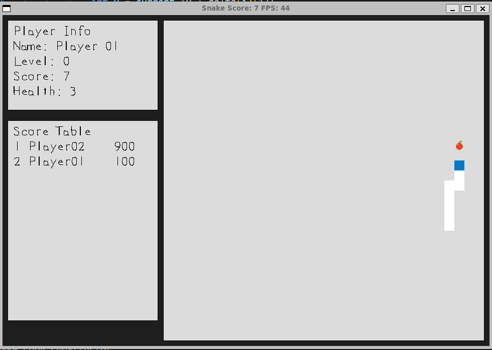
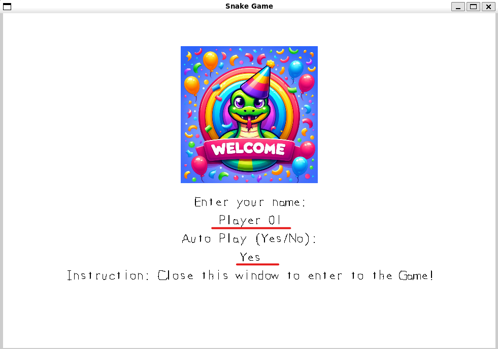
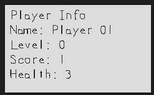
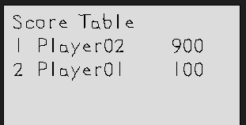

# CPPND: Capstone Snake Game Example

This is a starter repo for the Capstone project in the [Udacity C++ Nanodegree Program](https://www.udacity.com/course/c-plus-plus-nanodegree--nd213). The code for this repo was inspired by [this](https://codereview.stackexchange.com/questions/212296/snake-game-in-c-with-sdl) excellent StackOverflow post and set of responses.



The Capstone Project gives you a chance to integrate what you've learned throughout this program. This project will become an important part of your portfolio to share with current and future colleagues and employers.

In this project, you can build your own C++ application or extend this Snake game, following the principles you have learned throughout this Nanodegree Program. This project will demonstrate that you can independently create applications using a wide range of C++ features.

## New features

1. Allow config player's name and play mode (AutoPlay mode or User mode)

2. In AutoPlay mode, the snake will auto move to the fodd by find the shortest path using AStar algorithm.
3. Display Player Information

4. Display Score Board


## Rubric Points
### Loops, Functions, I/O
1. The project reads data from a file and process the data, or the program writes data to a file.
```cpp
void Game::ReadScoreboard()
void Game::WriteToScoreboard()
```
2. The project accepts user input and processes the input.
```cpp
std::pair<std::string, std::string> Renderer::RenderEnterPlayerWindow()
```
3. The project uses data structures and immutable variables.
```cpp
void Renderer::Render(Snake const &snake, SDL_Point const &food, Player *player, std::vector<Player> const &scores)
```
### Object Oriented Programming 
4. One or more classes are added to the project with appropriate access specifiers for class members.
5. Class constructors utilize member initialization lists.
6. Overloaded functions allow the same function to operate on different parameters.
### Memory Management
7. The project makes use of references in function declarations.
8. The project uses destructors appropriately.
9. The project uses scope / Resource Acquisition Is Initialization (RAII) where appropriate.
10. The project follows the Rule of 5.
11. The project uses move semantics to move data instead of copying it, where possible.
12. The project uses smart pointers instead of raw pointers.
### Concurrency
13. The project uses multithreading.
```cpp
void Game::AutoPlay()
```
14. A promise and future is used in the project.
15. A mutex or lock is used in the project.

## Dependencies for Running Locally
* cmake >= 3.7
  * All OSes: [click here for installation instructions](https://cmake.org/install/)
* make >= 4.1 (Linux, Mac), 3.81 (Windows)
  * Linux: make is installed by default on most Linux distros
  * Mac: [install Xcode command line tools to get make](https://developer.apple.com/xcode/features/)
  * Windows: [Click here for installation instructions](http://gnuwin32.sourceforge.net/packages/make.htm)
* SDL2 >= 2.0
  * All installation instructions can be found [here](https://wiki.libsdl.org/Installation)
  >Note that for Linux, an `apt` or `apt-get` installation is preferred to building from source.

  For example:
  * libsdl2-dev - Simple DirectMedia Layer development files
  ```
  sudo apt install libsdl2-dev
  ```
  * libsdl2-image-dev - Image loading library for Simple DirectMedia Layer 2, development files
  ```
  sudo apt install libsdl2-image-dev
  ```
  * libsdl2-ttf-dev - TrueType Font library for Simple DirectMedia Layer 2, development files
  ```
  sudo apt install libsdl2-ttf-dev
  ```

* gcc/g++ >= 5.4
  * Linux: gcc / g++ is installed by default on most Linux distros
  * Mac: same deal as make - [install Xcode command line tools](https://developer.apple.com/xcode/features/)
  * Windows: recommend using [MinGW](http://www.mingw.org/)

## Basic Build Instructions

1. Clone this repo.
2. Make a build directory in the top level directory: `mkdir build && cd build`
3. Compile: `cmake .. && make`
4. Run it: `./SnakeGame`.


## CC Attribution-ShareAlike 4.0 International


Shield: [![CC BY-SA 4.0][cc-by-sa-shield]][cc-by-sa]

This work is licensed under a
[Creative Commons Attribution-ShareAlike 4.0 International License][cc-by-sa].

[![CC BY-SA 4.0][cc-by-sa-image]][cc-by-sa]

[cc-by-sa]: http://creativecommons.org/licenses/by-sa/4.0/
[cc-by-sa-image]: https://licensebuttons.net/l/by-sa/4.0/88x31.png
[cc-by-sa-shield]: https://img.shields.io/badge/License-CC%20BY--SA%204.0-lightgrey.svg


## Reference Document
* [SDL Tutorials](https://wiki.libsdl.org/SDL2/Tutorials)
* [Beginning Game Programming v2.0](https://lazyfoo.net/tutorials/SDL/index.php)
* [SDL library in C/C++ with examples](https://www.geeksforgeeks.org/sdl-library-in-c-c-with-examples/)
